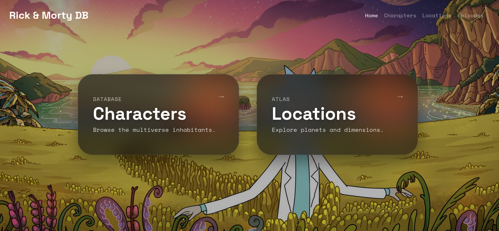

# Rick-and-Morty-fan-site-my-edition-
Uses the RaM API

# Rick and Morty Fan Site

A fan-made web application dedicated to the universe of "Rick and Morty". This project serves as a database for characters, locations, and episodes from the show.

## Features
* **Characters:** Detailed information about the citizens of the multiverse.
* **Locations & Episodes:** Browse through the series' iconic places and chapters.
* **Watchlist:** Plan your next binge-watching session.
* **Design:** Responsive UI built with Bootstrap 5.

## Tech Stack
* **HTML5** — page structure.
* **CSS3** — custom styling (located in `assets/style`).
* **JavaScript** — core application logic.
* **Bootstrap 5** — for modern and responsive layout.

## Project Structure
* `index.html` — landing page.
* `/pages` — separate views for characters, episodes, and locations.
* `/assets` — contains styles, scripts, and media assets.

